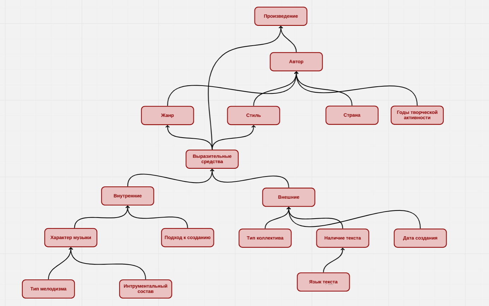
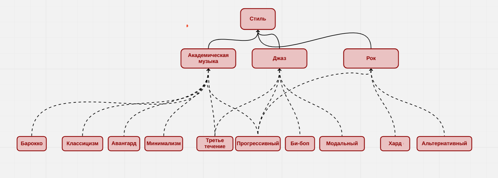
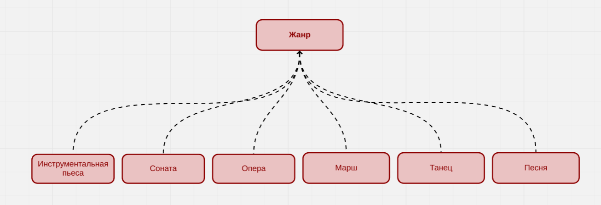
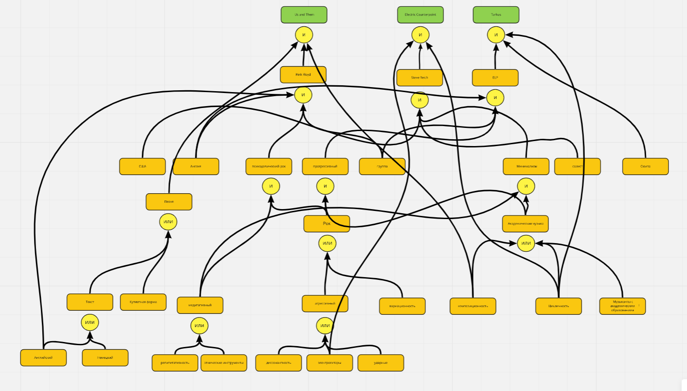
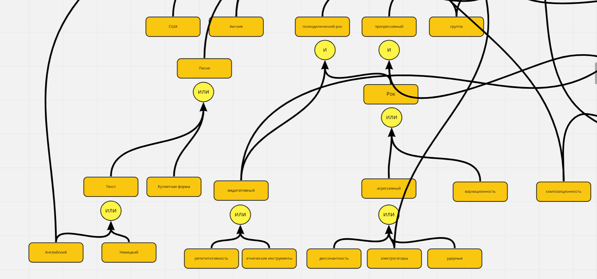
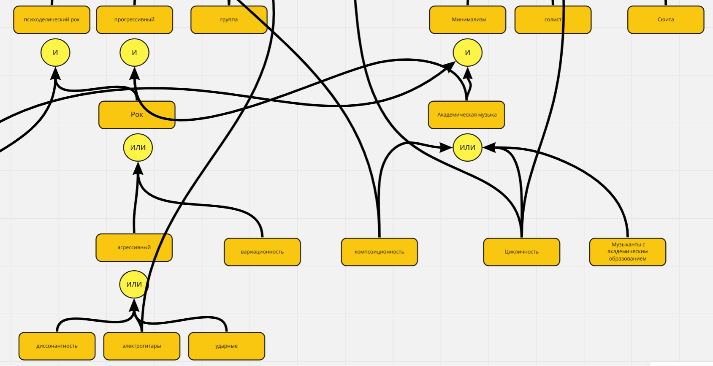
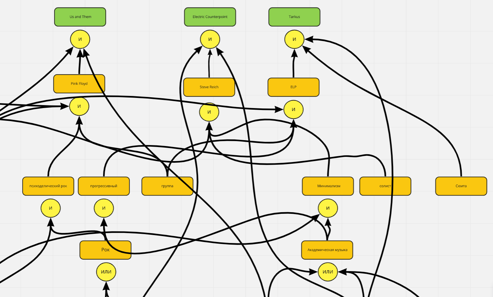
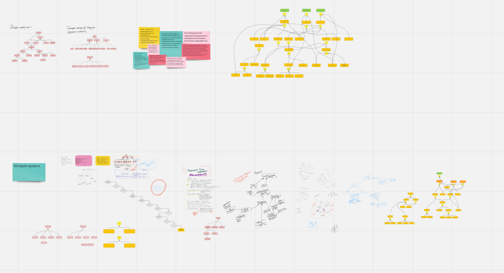
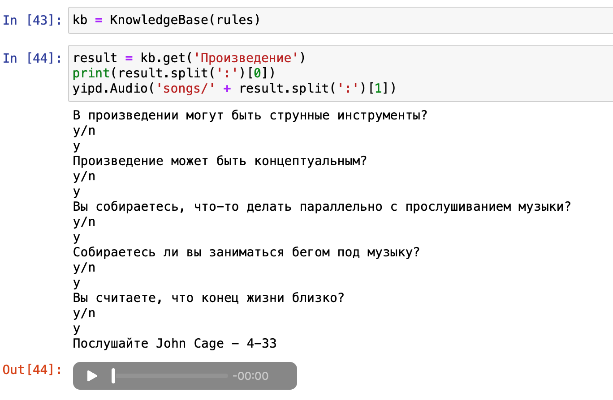
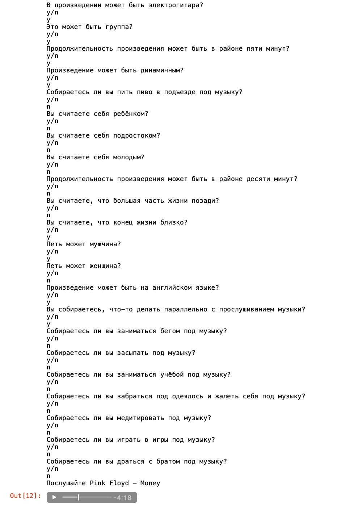

# Отчет по лабораторной работе
## по курсу "Искусственый интеллект"

### Студенты: 

| ФИО       | Роль в проекте                     | Оценка       |
|-----------|------------------------------------|--------------|
| Будникова | Концептуализация, разработка оболочки ЭС, написание отчёта |          |
| Глушатов  | Разработка оболочки ЭС, наполнение базы данных |       |
| Федоров   | Разработка оболочки ЭС, наполнение базы данных |      |
| Юревич    | Концептуализация, написание отчёта, наполнение базы данных |          |

## Результат проверки

| Преподаватель     | Дата         |  Оценка       |
|-------------------|--------------|---------------|
| Сошников Д.В. |              |    4.5           |

> *База знаний в целом достаточно похожа не таблицу, и не имеет глубинных рассуждений. Особенно выбор конкретного трека - это явно надо делать с помощью lookup-таблицы по каким-то критериям, которые получать на основе вывода. Хорошая идея давать послушать музыку прямо из ноутбука.*

## Тема работы

Предметной областью экспертной системы является музыка. 
Основной задачей системы является подбор музыкальных композиций исходя из запроса пользователя. 
Актуальность данной задачи заключается в упрощении процесса поиска произведения, подходящего 
слушателю в текущий момент. Так как весь состав команды слушает различную музыку, база может получиться очень
разнообразной и пёстрой.


## Концептуализация предметной области

Основные понятия:

Жанр - совокупность внемузыкальных и внутримузыкальных характеристик музыкального творчества 
(песня, танец, инструментальная пьеса, соната, опера, марш)

Стиль - общая совокупность внутримузыкальных выразительных средств характерных 
для группы авторов или произведений (джаз, рок, поп, академическая музыка)

Выразительные средства - конкретные характеристики музыкального творчества как внутренние 
(темп, продолжительность, характер мелодизма), так и внешние (наличие текста, связь с танцем, размер состава)

Инструментальный состав - группы инструментов (духовые, струнные, ударные) или отдельные инструменты 
(вокал, электрогитара), задействованные в произведении.

Подход к созданию произведения - внутреннее выразительное средство и одна из характеристик стиля. 
Музыка может быть заранее выписана композитором как законченное произведение, а затем исполняться 
по нотам (композиционность), или создаваться на ходу в процессе музицирования (импровизационность), 
а также возможно совмещение этих характеристик.

Характер музыки - аффект создаваемый конкретным произведением, грубо говоря "настроение" 
(лирический, трагический, праздничный)

Тип мелодической - характер мелодического материала (кантилена, речитатив, маршевость)

Онтология имеет тип иерархии. Связи между понятиями наглядно отображены на следующем рисунке:



Пример иерархии внутри отдельных понятий:




Возможные статические и динамические данные продемонстрируем с помощью примера: 
1.  Состояние задачи (статистические знания):
    Английский текст, Электрогитары, Импровизационность.

2.  Применяем знания (динамические знания):
    (Электрогитары) => Импровизационность характер музыки.

3.  Переходим к другому состоянию задачи (статистические):
    Английский текст, Импровизационность, Агрессивность.

4.  Применяем знания (статистические знания):
    (Импровизационность + Агрессивность) => Рок.

5.  Переходим к другому состоянию задачи (статистические):
    Английский текст, Рок.


Фрагмент дерева И/ИЛИ нарисованный в ходе работы:





"Следы" рабочего процесса:


## Принцип реализации системы

Мы использовали **обратный механизм вывода**, так как нам показалась, что такая модель будет наиболее подходящей для нашей темы проекта. Для реализации мы использовали язык программирования **Python** в среде разработки **Jupyter Notebook**, потому что данный язык нам знаком и прост в использовании, а среда позволяет наглядно и быстро демонстрировать результаты работы. В нашей системе есть **база правил**, в которой определены понятия и их правила вывода, а также **механизм вывода**, который с помощью взаимодействия с пользователем позволяет на базе поданных правил выводить музыкальные рекомендации по предпочтениям пользователя.  

## Механизм вывода

Механизм вывода является рекурсивным с мемоизацией. Программа пытается доказать случайную песню по цепочке правил вывода. Разбирая цепочки правил, программа рано или поздно доходит до базовых понятий.  
```python
def eval(self, expr, field=None):
        def Question(field):
            return questions[field] if field in questions else field

        if isinstance(expr, Ask):
            print(Question(field))
            return expr.ask()
        
        elif isinstance(expr, NOT):
            return 'n' if self.eval(expr.x) == 'y' else 'y'
        
        elif isinstance(expr, IF):
            return self.eval(expr.x)
        
        elif isinstance(expr, AND) or isinstance(expr, list):
            expr = expr.x if isinstance(expr, AND) else expr
            for x in expr:
                if self.eval(x) == 'n':
                    return 'n'
            return 'y'
        
        elif isinstance(expr, OR):
            for x in expr.x:
                if self.eval(x) == 'y':
                    return 'y'
            return 'n'
        
        elif isinstance(expr, str):
            return self.get(expr)
        
        else:
            print("Unknown expr: {}".format(expr))
```

После этого пользователю задается вопрос, на который может ответить да(y) или нет(n). После получения ответа от пользователя программа заносит его в рабочую память. Если доказательство не успешно, то программа пытается доказать другую песню, если песни для доказательства закончились, то пользователю выдается соответствующее сообщение. После успешного доказательства правил пользователю выдается название песни представляется интерфейс для прослушивания песни.  


## Извлечение знаний и база знаний

Эксперт по знаниям в нашей команде является специалистом в выбранной нами области, поэтому он располагал большим количеством знаний. Мы опрашивали нашего эксперта и параллельно пытались составить дерево И/ИЛИ. После составления некоторых концептов мы пришли к выводу, что обычному пользователю будет трудно разобраться в профессиональных музыкальных понятиях. Ошибкой оказалось – раскладывать произведения на академические музыкальные понятия, которые не редко оказывались неделимыми, что подразумевало задание вопроса пользователю, на который человеку без музыкального образования сложно ответить. Мы пришли к решению данной проблемы путем переосмысления концепции нашей экспертной системы, вследствие чего она стала больше ориентироваться на эмоциональный и чувственный отклик пользователя.  

## Протокол работы системы




## Выводы

При выполнении лабораторной работы мы разработали архитектуру и концепт нашей экспертной системы. Получили небольшой опыт в многоступенчатой разработки проекта. Мы изучили методологию выводов экспертной системы и успешно применили обратный вывод при реализации. Для эффективной командной работы мы использовали Discord, Miro и Telegram. Трудностью с который мы столкнулись было то, что изначально мы составили нашу систему для опытного музыканта, а не обычного пользователя. Так как в команде присутствовали люди с разным опытом в музыкальной сфере, то мы смогли легко выявить эту неточность. Работа в команде позволила нам намного быстрее разобраться в поставленной задаче, чем если бы работу выполнял один человек. Разделение обязанностей помогло нам реализовать навыки каждого участника команды.    
